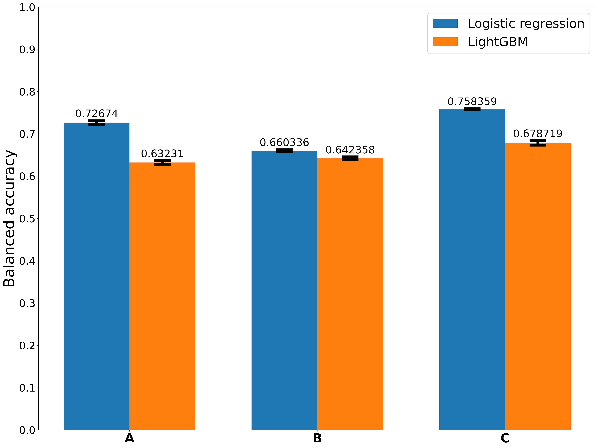
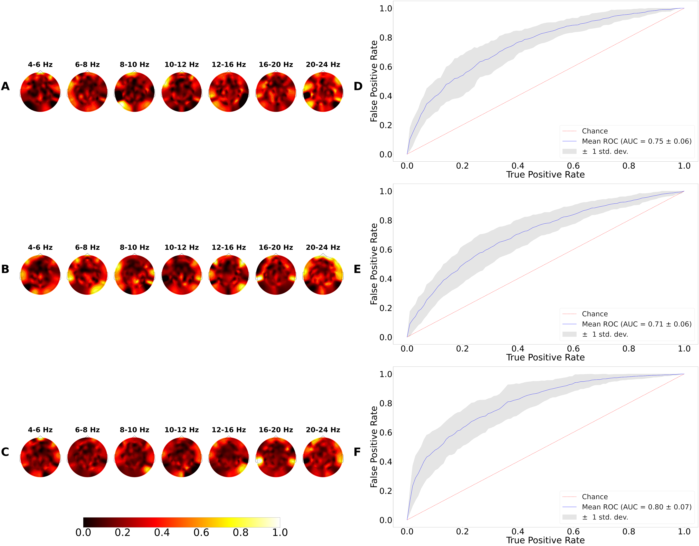

# IHNA project

Tools for processing ERPs and oscillatory activity of EEG

With the help of these tools, the following projects were carried out:

##### Table of Contents

[Mathematicians versus humanitarians](#link1)

<a name="link1"/>
##### 1) Classification of mathematicians from the humanities based on the oscillatory activity of the EEG 

ihna_classification_mat_versus_hum_tasks.ipynb

<!--suppress HtmlDeprecatedAttribute -->

 <b>Classification of tasks using oscillatory activity</b> 

 <b>Classification of mathematicians versus humanitarians</b> 

2) Classification of mathematicians from the humanities based on the oscillatory activity of the EEG recorded at rest 
(Eyes open)\
ihna_classification_mat_versus_hum_resting_state.ipynb
3) Prediction of the age of children and adolescents based on ERPs upon presentation of auditory        stimuli
of varying intensity\
ihna_age_prediction.ipynb\
Preliminary results were presented on FENS 2022 (neurodevelopment section)\
Poster Fens_2022_Mikheev.pdf

