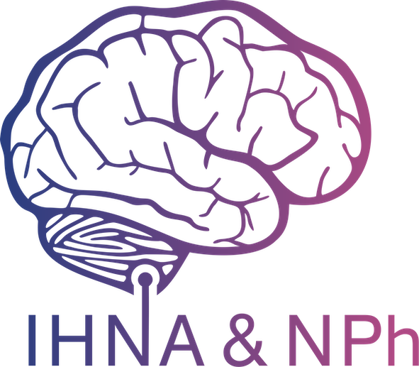
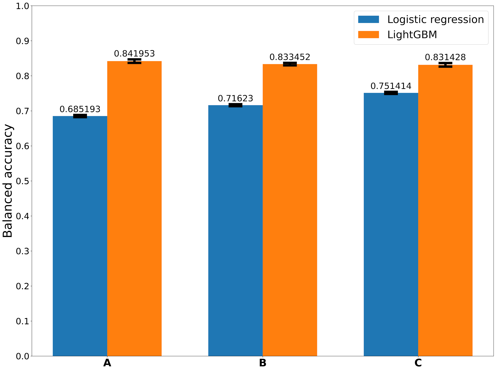
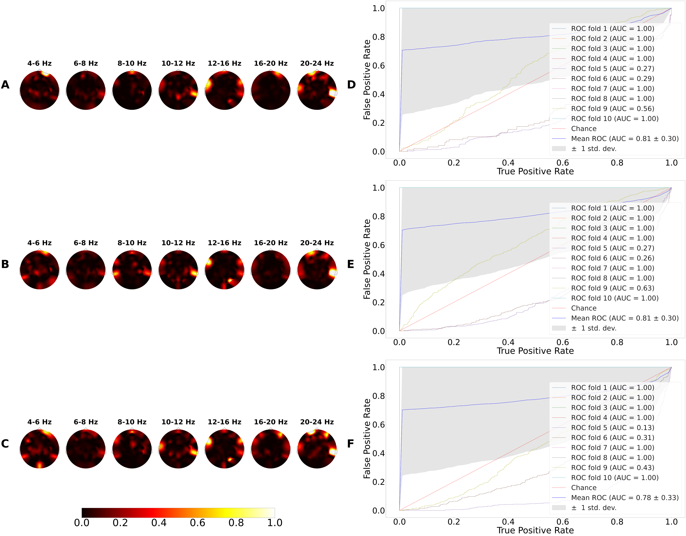

# IHNA project

Tools for processing ERPs and oscillatory activity of EEG

With the help of these tools, the following projects were carried out:

##### Table of Contents

[Mathematicians versus humanitarians using oscillatory activity](#link1)

[Mathematicians versus humanitarians, resting state](#link2)

[Prediction of children age using patterns of auditory ERPs of varying intensity](#link3)

[Articles and posters](#link4)

<a name="link1"/>

##### Classification of mathematicians from the humanities based on the oscillatory activity of the EEG

[Notebook](notebooks/ihna_classification_mat_versus_hum_tasks.ipynb)

###### Accuracy

###### Patterns and filters

###### Feature importance

<a name="link2"/>

##### Classification of mathematicians from the humanitarians, resting state(Eyes open)

[Notebook](notebooks/ihna_classification_mat_versus_hum_resting_state.ipynb)

<a name="link3"/>

##### Prediction of children age using patterns of auditory ERPs of varying intensity

[Notebook](notebooks/ihna_age_prediction.ipynb)

<a name="link4"/>

##### Articles and posters

###### FENS 2022 (neurodevelopment section)

[Poster](Articles_and_posters/Fens_2022_Mikheev.pdf)

###### Neuroscience Baltic Forum 2022

[Short article](Articles_and_posters/children_age_prediction.pdf)

